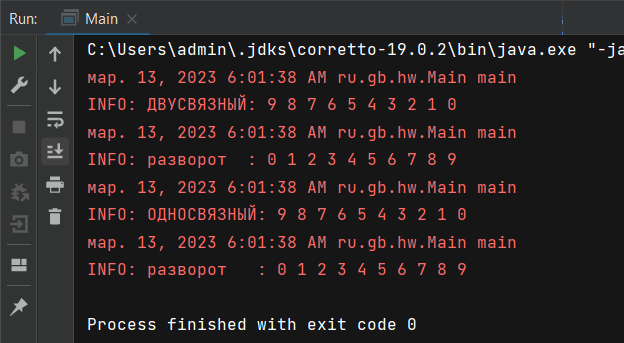

# Алгоритмы и структуры данных

Необходимо реализовать метод разворота связного списка (двухсвязного или односвязного на выбор).

Реализовано оба варианта. В разнотипных списках применены различные способы формирования перевернутого списка. 

Поворот для двунаправленного списка выполняется посредством обмена указателей предыдущего / следующего элемента. 

**Двунаправленный:**

```java 
public void reverse() {
        NodeTwice tmp;
        NodeTwice tmpNext;
        for(tmp = this.head; tmp != null; tmp = tmpNext) {
            tmpNext = tmp.getNext();
            tmp.setNext(tmp.getPrev());
            tmp.setPrev(tmpNext);
        }

        tmp = this.head;
        this.head = this.tail;
        this.tail = tmp;
    }
```

Для однонаправленного списка при повороте указатель начала списка копируется во временную переменную, указатель головного элемента присваивается ```null```. При помощи метода добавления формируется новый список. 

**Однонаправленный:**

```java
    public void reverse() {
        NodeOnce oldHead = this.head;
        NodeOnce tmp = oldHead;

        for(this.head = null; tmp != null; tmp = tmp.getNext()) {
            this.add(tmp.getData());
        }

        oldHead = null;
    }
```

Оба варианта имеют сложность O(n). Способ примененный для односвязного списка менее эффективен изза потребления ресурсов (возможен ваниант с обменом ссылок).


**Скрин выполнения:**

